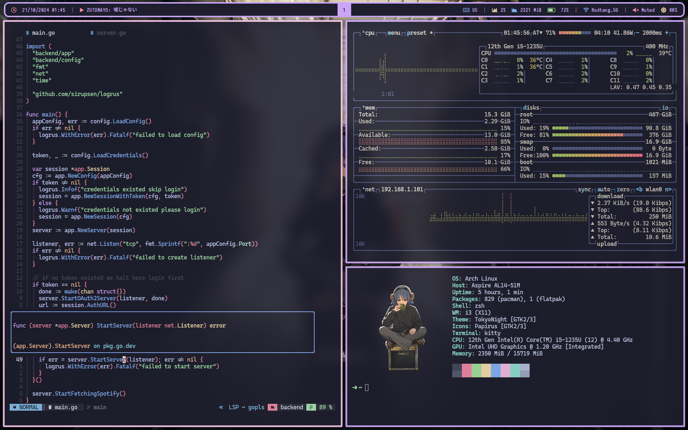

# Dotfile

- [go-librespot](https://github.com/devgianlu/go-librespot) controll using
  [n_spotify_controller.py](/.config/scripts/n_spotify_controller.py)
- deprecated
  - [librespot-java](https://github.com/librespot-org/librespot-java) controll
    using [n_spotify_controller.py](/.config/scripts/n_spotify_controller.py)
  - [spotifyd](https://github.com/Spotifyd/spotifyd) fork that used in this
    config [momozahara/spotifyd](https://github.com/momozahara/spotifyd)
    - you can't control other device music using spotifyd that's why I bind
      spotify client to workspace 10 and yes I dont use tui

