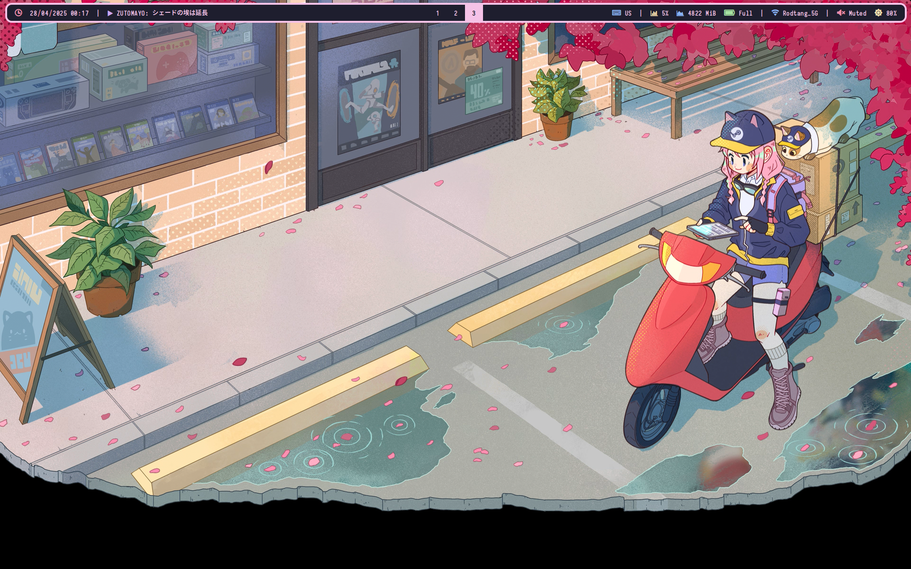
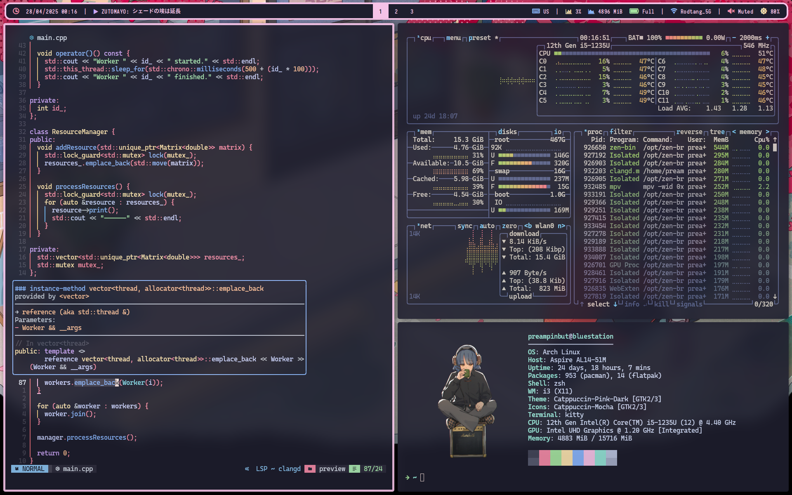

# Dotfile

- [spotifyd](https://github.com/Spotifyd/spotifyd) fork that used in this config
  [momozahara/spotifyd](https://github.com/momozahara/spotifyd)
  - you can't control other device music using spotifyd that's why I bind
    spotify client to workspace 10 and yes I dont use tui

